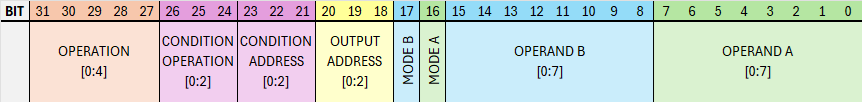
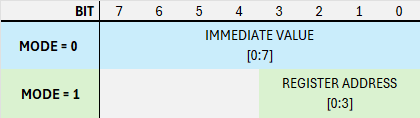

# Instruction Set

## Instruction

Every instruction is encoded in a 32-bit word with the following layout:

### Operation

The actual operation that should be performed. See the section _Operations_ for a list of all possible operations.

### Condition

Each instruction specifies a condition which takes the value `C` from the register specified in `CONDITION ADDRESS` and maps it to either `true` or `false`.
This evaluation happens just before the instruction would be executed. The instruction is then only executed if the instruction has been evaluated to `true`.
If the instruction was evaluated to be `false` the instruction is skiped and no other changes are made to the state of the computer.
The following 8 conditions are available:

Condition | Value | Description
:---:| :---: | ---
ALWAYS | `0b000` | Always evaluates to `true` no matter the input.
NEVER | `0b001` | Always evaluates to `false` no matter the input.
= 0 | `0b010` | Returns `true` if `C = 0` otherwise `false`.
≠ 0 | `0b011` | Returns `true` if `C ≠ 0` otherwise `false`.
< 0 | `0b100` | Returns `true` if `C < 0` otherwise `false`.
≥ 0 | `0b101` | Returns `true` if `C ≥ 0` otherwise `false`.
\> 0 | `0b110` | Returns `true` if `C > 0` otherwise `false`.
≤ 0 | `0b111` | Returns `true` if `C ≤ 0` otherwise `false`.

### Output Address

The instruction contains bits 0:2 of the address of the register in which the result of the operation should be stored.
Note that bit 3 is controlled by the operation itself, for the load_2 instruction the bit is set, otherwise it is cleared.

### Operands A & B

Each instruction has two operands, A and B that are the "inputs" to the operation. Each operand consists of a 8bit value `OPERAND` and a mode bit `MODE`, whose value determines how the value is interpreted:

- **MODE = 0**: The 8 bit value is directly used as an immediate value.

- **MODE = 1**: The lower 4 bits of the value are the address of the register whose value is to be used. The upper 4 bits are unused and should be cleared to 0.

## Operations

### Load

Load operations write their input value directly to the output.

Operation | Value | Description
:---:| :---: | ---
LOAD2 | `0b00000` | Creates a 16-bit word using the value of `A` for the lower, and the value of `B` for the upper 8 bits. The value is then stored in the special function register, specified by the output address.
LOAD | `0b00001` | Output the value of `A`.

### Logic

The logic operations take the values of `A` and `B` and perform a bitwise logical operation on them, the result of which is then outputed.

Operation | Value | Description
:---:| :---: | ---
AND | `0b00010` | Bitwise and.
NAND | `0b00011` | Bitwise nand.
OR  | `0b00100` | Bitwise or.
NOR | `0b00101` | Bitwise nor.
XOR | `0b00110` | Bitwise xor.
XNOR | `0b00111` | Bitwise xnor.

### Arithmetic

The arithmetic operations take the values of `A` and `B` and perform an arithmetic operation on them, the result of which is then outputed. Every arithmetic operation also modifies the arithmetic carry bit, depending on the operation and its input values.

Operation | Value | Description
:---:| :---: | ---
ADD | `0b01000` | Calculates `A` + `B`.
SUBTRACT | `0b01001` | Calculates `A` - `B`.
ADD WITH CARRY | `0b01010` | Calculates `A` + `B` + `carry`.
SUBTRACT WITH CARRY | `0b01011` | Calculates `A` - `B` - (1 - `carry`).

### Shift

The shift operations take the value of `A` and shift it either to the left or to the right by one bit. The bit that is "shifted out" is always placed in the shift carry bit.

Operation | Value | Description
:---:| :---: | ---
SHIFT LEFT | `0b01100` | Shifts `A` one to the left. The LSB, bit 0, is set to `0`. This is equivalent to multiplying the unsigned value of `A` with 2.
SHIFT RIGHT | `0b01101` | Shifts `A` one to the right. The MSB, bit 7, is set to `0`. This is equivalent to dividing the unsigned value of `A` by 2.
ROTATE LEFT | `0b01110` | Shifts `A` one to the left. The LSB, bit 0, is set to the previous value of the shift carry bit.
ROTATE RIGHT | `0b01111` | Shifts `A` one to the right. The MSB, bit 7, is set to the previous value of the shift carry bit.

### Decode

The decode operations take the value of bits 0..2 of `A` as an unsigned 3-bit integer. A bit-mask is then generated, where only the bit specified by that value is set / cleared.

Operation | Value | Description
:---:| :---: | ---
NDECODE | `0b10000` | Generates a word where all 8 bits are set except for the bit specified by `A` which is cleared.
DECODE | `0b10001` | Generates a word where all 8 bits are cleared except for the bit specified by `A` which is set.

### Memory

The memory operations are used to read from / write to the memory of the computer. Both operations have in common, that they construct the 16 bit memory address by using `A` for the lower 8 bits of the address and the value of the `PAGE` register for the higher 8 bits.

Operation | Value | Description
:---:| :---: | ---
LOAD | `0b10100` | Loads the value of the memory cell at the current address and writes it to the output.
STORE | `0b10101` | Stores the value of `B` at the current address. The output of this operation is not written to any register.

### IO

AX08 has two io units. Each of them has the following three operations. Which io unit is used is indicated by bit 2 of the opcode, in the following table marked as an 'x'. A `0` stands for io-unit 0, a `1` for io-unit 1.

Operation | Value | Description
:---:| :---: | ---
POLL | `0b11x00` | Outputs a `1` if a value is available to be read, otherwise `0`.
READ | `0b11x01` | Reads a value from the io port.
WRITE | `0b11x10` | Writes the value of `A` to the io port.

### Break

The break instruction causes the ax08 computer to halt at the end of the instruction. Combined with conditions this allows for a simple version of "Software Breakpoints".

Operation | Value | Description
:---:| :---: | ---
BREAK | `0b11111` | Causes the computer to halt.
